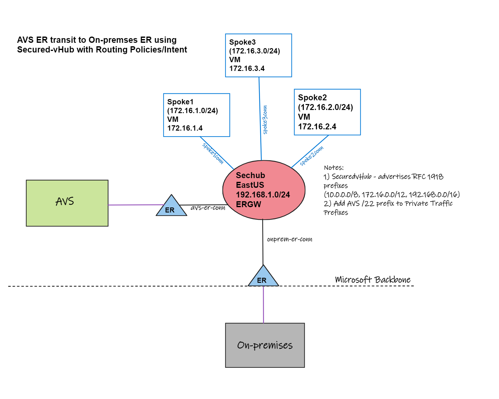

# Azure VMware Solution

**Articles and labs**

### LAB: AVS (ER) to On-prem (ER) transit using Secured-vHub+Routing Intent

Lab deployment script:

```bash
wget -O svh-avs-er-deploy.sh https://raw.githubusercontent.com/dmauser/azure-vmware-solution/main/svh-er-transit/svh-avs-er-deploy.azcli
chmod +xr svh-avs-er-deploy.sh
./svh-avs-er-deploy.sh
```

Please, run the script above via [Azure Cloud Shell (Bash)](https://shell.azure.com/) or Azure CLI on Linux.

Default variables:

```Bash
#Parameters
region=eastus
rg=lab-svh-avs # set your Resource Group
vwanname=svh-avs # vWAN name
hubname=svhub # vHub name
username=azureuser # Username
password="Msft123Msft123" # Please change your password
vmsize=Standard_B1s # VM Size
firewallsku=Premium #Azure Firewall SKU Standard or Premium
```


#### Network diagram



#### Use cases

- ExpressRoute Local SKU.
- Lack of Global Reach feature.
- Traffic inspection between AVS and On-premises is required.

#### Considerations

- ExpressRoute Circuits are not created as part of this lab.
- Routing intent is enabled only for Private Traffic. Currently, Private and Internet traffic is not supported for most of the regions. More details see purple box note under Background session of [How to configure Virtual WAN Hub routing intent and routing policies](https://learn.microsoft.com/en-us/azure/virtual-wan/how-to-routing-policies).
- After connecting the AVS ExpressRoute Circuit, go to Firewall Manager - Security Configuration and enable secure Internet Traffic to allow the default route (0.0.0.0/0) to be advertised to the AVS environment.
- Add AVS /22 prefix inside the Private traffic prefixes.

#### Field notes

- Review carefully all the considerations when enabling routing policies/intent by reviewing [Virtual WAN Hub routing intent and routing policies - Troubleshooting data path](https://learn.microsoft.com/en-us/azure/virtual-wan/how-to-routing-policies#troubleshooting). Especially RFC 1918 prefixes (10.0.0.0/8, 172.16.0.0/12, 192.168.0.0/16) which are advertised by default from Secured-vHUB. If the On-premises ExpressRoute circuit already advertises those prefixes, routing adjustments must be made before enabling Routing-Intent.
- Always onboard ExpressRoute circuits (including On-premises) after converting Secured-vHub plus Routing Policies/Intent. Otherwise, converting after it will have the default route (0.0.0.0/0) advertised to all connections. That will give you granular control on securing Internet traffic (the default route 0/0 advertisement).


### LAB: AVS (ER) to On-prem (VPN) transit using Secured-vHub+Routing Intent

Lab deployment script:

```bash
wget -O svh-avs-vpn-er.sh https://raw.githubusercontent.com/dmauser/azure-vmware-solution/main/svh-vpn-er/svh-avs-vpn-er.azcli
chmod +xr svh-avs-vpn-er.sh
./svh-avs-vpn-er.sh
```

Please, run the script above via [Azure Cloud Shell (Bash)](https://shell.azure.com/) or Azure CLI on Linux.

Default variables:

```Bash
#Parameters
region=southcentralus
rg=lab-svh-vpner # set your Resource Group
vwanname=svh-avs-vpner # vWAN name
hubname=svhub # vHub name
username=azureuser # Username
password="Msft123Msft123" # Please change your password
vmsize=Standard_B1s # VM Size
firewallsku=Premium #Azure Firewall SKU Standard or Premium
```